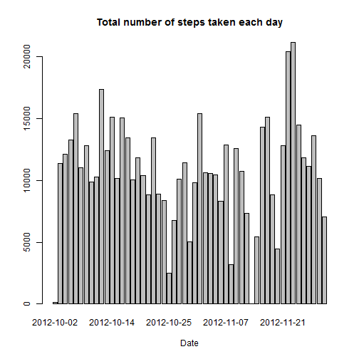
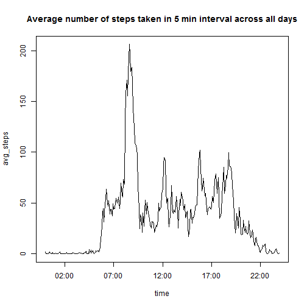
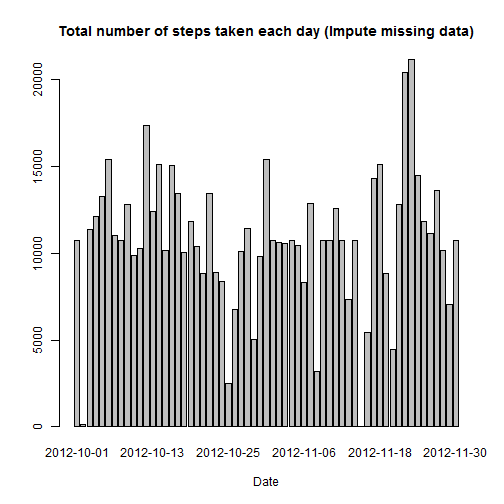

## Loading and preprocessing the data

```r
data <- read.csv("activity.csv", as.is=TRUE)
valid_data <- data[complete.cases(data$steps), ]
```

## What is mean total number of steps taken per day?

```r
total_steps <- tapply(valid_data$steps, as.factor(valid_data$date), sum)
barplot(total_steps, main="Total number of steps taken each day", xlab="Date")
```

 

```r
mean_total_steps <- mean(total_steps, na.rm=TRUE)
median_total_steps <- median(total_steps, na.rm=TRUE)
```

Mean total number of steps taken per day = 1.0766189 &times; 10<sup>4</sup>  
Median total number of steps taken per day = 10765

## What is the average daily activity pattern?

```r
avg_steps <- tapply(valid_data$steps, as.factor(valid_data$interval), mean)
interval4d <- sprintf("%04d", as.numeric(row.names(avg_steps)))
time <- strptime(paste(substr(interval4d, 1, 2), substr(interval4d, 3, 4), sep = ':'), "%H:%M")
plot(time, avg_steps, main="Average number of steps taken in 5 min interval across all days", type="l")
```

 

```r
max_steps <- avg_steps[[which.max(avg_steps)]]
max_steps_interval <- interval4d[which.max(avg_steps)]
```

On average across all the days in the dataset, the interval 0835  
contains the maximum number of steps (206.1698113 steps)

## Imputing missing values

```r
num_missing <- sum(is.na(data$steps))
```
Total number of missing values = 2304  
Strategy : Fill in missing values with the mean for that 5-minute interval


```r
index_na <- which(is.na(data$steps))
interval4d <- sprintf("%04d", as.numeric(data[index_na, "interval"]))
time <- strptime(paste(substr(interval4d, 1, 2), substr(interval4d, 3, 4), sep = ':'), "%H:%M")
index_avg <- time$hour * 12 + time$min / 5 + 1
new_data <- data
new_data[index_na, "steps"] <- avg_steps[index_avg]

new_total_steps <- tapply(new_data$steps, as.factor(new_data$date), sum)
barplot(new_total_steps, main="Total number of steps taken each day (Impute missing data)", xlab="Date")
```

 

```r
new_mean_total_steps <- mean(new_total_steps)
new_median_total_steps <- median(new_total_steps)
```
After imputing data,  
New mean total number of steps taken per day = 1.0766189 &times; 10<sup>4</sup>  
New median total number of steps taken per day = 1.0766189 &times; 10<sup>4</sup>  

These values do not differ from the estimates from the first part of the assignment.  
There is no impact of imputing missing data on the estimates of the total daily number of steps  

## Are there differences in activity patterns between weekdays and weekends?

```r
date <- strptime(new_data$date, "%Y-%m-%d")
new_data$weekday <- factor(ifelse(is.element(date$wday, c(0,6)), "weekend", "weekday"))
split_data <- split(new_data, new_data$weekday)
avg_steps_weekday <- tapply(split_data[[1]]$steps, as.factor(split_data[[1]]$interval), mean)
avg_steps_weekend <- tapply(split_data[[2]]$steps, as.factor(split_data[[2]]$interval), mean)

steps <- c(avg_steps_weekday, avg_steps_weekend)
interval <- as.numeric(c(row.names(avg_steps_weekday), row.names(avg_steps_weekend)))
weekday <- c(rep("weekday", times = length(avg_steps_weekday)), rep("weekend", times = length(avg_steps_weekend)))
library(lattice)
xyplot(steps ~ interval | weekday, layout=c(1, 2),type="l")
```

 

The plots for weekdays and weekends show some differences in activity patterns,  
eg. more steps are taken early morning on weekdays  
and more steps are taken late night on weekends  
